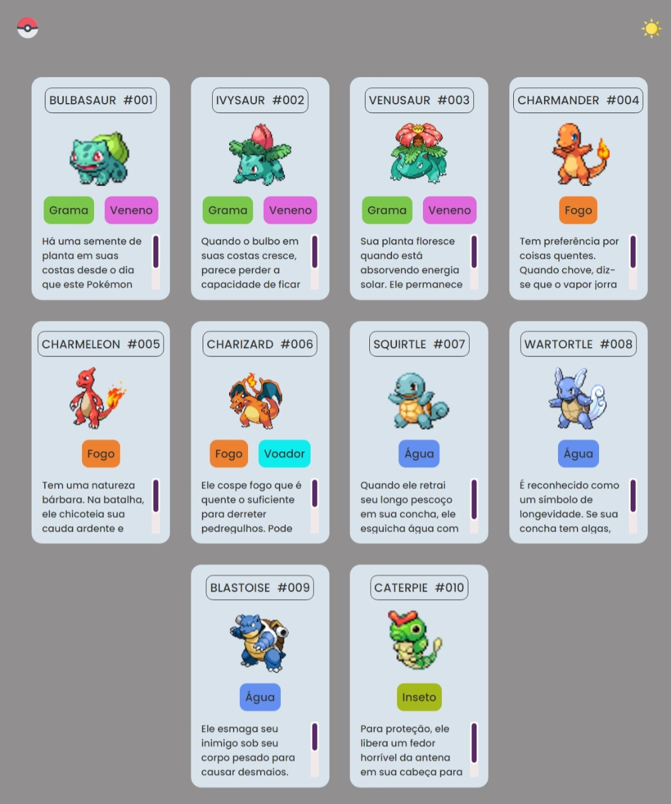

# Projeto Pokédex

Esse é um projeto guiado feito para aprender as bases do HTML, CSS e Javascript.

## Screenshot

## Construído com

- HTML semântico
- CSS
- Javascript

## Links

- URL do projeto: (https://gadiel-s.github.io/projeto_pokedex/)
- LinkedIn: (https://www.linkedin.com/in/gadielsouzafrontend/)
- Github: (https://github.com/Gadiel-S)
- Portfolio - [Gadiel Souza de Barros](https://gadiel-s.github.io/meu-portfolio/)
